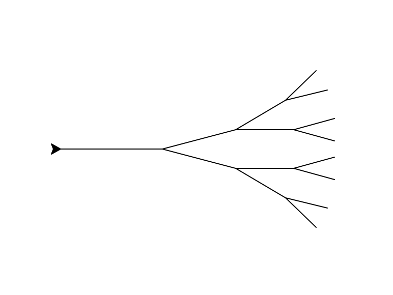

# HW2 - Turtle and Pygame
Due Date:

Download the zip file with all necessary base files for both parts of this homework here.

[HW2.zip](../HWs/HW2.zip)

## Part 1 - Turtle Graphics Fractals

In this portion of the homework you will be getting some practice using the turtle graphics library as well as using recursion. 

For question #2, here is an example of what a tree could look like, but we will accept any structure that resembles a recursive tree (eg. more than 2 branches or vertical).

## Part 2 - Pygame Mini-Game

For this portion of the homeowork, we’ve designed a base game with simple pieces: four walls, a background, a character you control, and food that spawns one at a time in random places. The mechanics of this game right now are even simpler: the character’s goal is to collect the food to rack up points. Points are displayed outside the walls within the game screen. Each food is worth the same amount of points and the game goes on forever. 

Your job is to design two creative mechanics that alter the way the game works. Some ideas in which you could alter the game include the way the main character interacts with other elements of the game, win/lose conditions, enemies, etc. You really can be as creative as you want. The goal of this homework is to get you familiar with Pygame mechanics as well as think like a game designer, so you should aim to challenge both your game mechanic design and your level of Pygame expertise. Feel free to edit the base game in whatever way you like. If you ever need to start over you can re-download the starter files.

### EXTRA CREDIT:

0.5 points: Make it look pretty.

0.5 points: Add a third creative mechanic.

